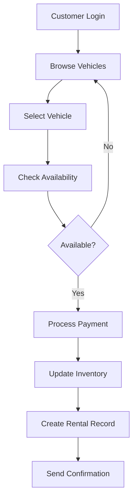
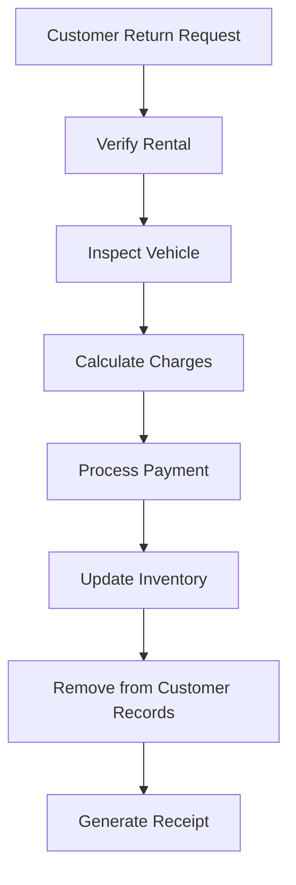

# 🚗 VeloRent - Vehicle Rental Management System

[](https://openjdk.java.net/projects/jdk/17/)
[](https://spring.io/projects/spring-boot)
[](https://maven.apache.org/)
[](LICENSE)

> **VeloRent** is a comprehensive vehicle rental management system developed as part of the Object-Oriented Programming module at SLIIT. The system provides a complete solution for vehicle rental operations, event management, and customer services through a modern Spring Boot web application.

## 📖 Table of Contents

- [Project Overview](#-project-overview)
- [Features](#-features)
- [Technology Stack](#-technology-stack)
- [System Architecture](#-system-architecture)
- [Installation & Setup](#-installation--setup)
- [Usage Guide](#-usage-guide)
- [Development Methodology](#-development-methodology)
- [API Documentation](#-api-documentation)
- [Team Members](#-team-members)
- [Project Structure](#-project-structure)
- [Contributing](#-contributing)
- [License](#-license)

## 🎯 Project Overview

**VeloRent** is a full-stack vehicle rental management system that streamlines the entire rental process from vehicle inventory management to customer service delivery. Built with modern web technologies and following industry best practices, the system offers:

### 🎯 Key Objectives
- Digitize traditional vehicle rental operations
- Provide seamless customer experience from booking to return
- Enable efficient fleet management and tracking
- Offer comprehensive reporting and analytics
- Support multiple payment methods and booking channels

### 🏢 Target Users
- **Customers**: Individuals looking to rent vehicles
- **Fleet Managers**: Staff managing vehicle inventory and operations
- **Administrators**: System administrators overseeing the platform
- **Event Coordinators**: Personnel managing special events and bookings

## ✨ Features

### 🚙 **Core Vehicle Management**
- 🔍 **Smart Vehicle Discovery**: Advanced search and filtering capabilities
- 📊 **Real-time Inventory**: Live vehicle availability tracking
- 🚗 **Fleet Management**: Comprehensive vehicle lifecycle management
- 📱 **Mobile-Responsive Design**: Seamless experience across all devices

### 👤 **Customer Experience**
- 🔐 **Secure Authentication**: User registration and login system
- 📋 **Profile Management**: Comprehensive customer profiles
- 🎫 **Booking History**: Complete rental and event booking records
- 💳 **Multiple Payment Options**: Cash and card payment support

### 🎉 **Event Management**
- 📅 **Event Booking**: Special event vehicle reservations
- 🎊 **Package Deals**: Bundled services and discounts
- 📈 **Event Analytics**: Booking patterns and insights

### 🛡️ **Administrative Features**
- 👥 **Staff Management**: Role-based access control
- 💰 **Discount Management**: Flexible pricing and promotions
- 📊 **Comprehensive Reporting**: Business intelligence and analytics
- 🔧 **System Configuration**: Customizable system settings

### 🔌 **Technical Features**
- 🌐 **RESTful API**: Complete backend API for integration
- 📁 **File-Based Persistence**: Lightweight data storage solution
- ⚡ **Performance Optimized**: Fast response times and efficient processing
- 🛠️ **Error Handling**: Robust exception management and validation

## 🧰 Technology Stack

### **Backend Technologies**
| Component | Technology | Version | Purpose |
|-----------|------------|---------|---------|
| **Language** | Java | 17 LTS | Core programming language |
| **Framework** | Spring Boot | 3.4.5 | Web application framework |
| **Build Tool** | Maven | 3.6+ | Dependency management & build automation |
| **API Design** | REST | - | Web service architecture |

### **Frontend Technologies**
| Component | Technology | Purpose |
|-----------|------------|---------|
| **Template Engine** | Thymeleaf | Server-side rendering |
| **Styling** | CSS3 | User interface styling |
| **Scripting** | JavaScript | Client-side interactions |
| **UI Framework** | Bootstrap | Responsive design |

### **Development & Tools**
| Tool | Purpose |
|------|---------|
| **IDE** | IntelliJ IDEA | Development environment |
| **Version Control** | Git | Source code management |
| **Methodology** | Agile/Scrum | Project management |
| **Testing** | JUnit | Unit testing framework |

### **Data Storage**
| Type | Implementation | Files |
|------|---------------|-------|
| **Customer Data** | Text Files | `customers.txt` |
| **Vehicle Inventory** | Text Files | `vehicles.txt` |
| **Event Management** | Text Files | `events.txt`, `event_bookings.txt` |
| **Financial Records** | Text Files | `payments.txt`, `discounts.txt` |
| **System Data** | Text Files | `staff.txt`, `purchased_vehicles.txt` |

## 🏗️ System Architecture

### **Application Layers**
```
┌─────────────────────────────────────┐
│            Presentation Layer        │  ← Thymeleaf Templates, CSS, JS
├─────────────────────────────────────┤
│            Controller Layer          │  ← Spring MVC Controllers
├─────────────────────────────────────┤
│            Service Layer             │  ← Business Logic Services
├─────────────────────────────────────┤
│            Repository Layer          │  ← Data Access Objects
├─────────────────────────────────────┤
│            Data Layer                │  ← File-based Storage System
└─────────────────────────────────────┘
```

### **Key Components**
- **Controllers**: Handle HTTP requests and responses
- **Services**: Implement business logic and operations
- **Repositories**: Manage data persistence and retrieval
- **Models**: Define entity structures and relationships
- **Utilities**: Provide common functionality and helpers

## 🚀 Installation & Setup

### **Prerequisites**
Ensure you have the following installed on your system:

```bash
# Java Development Kit (JDK) 17 or later
java -version

# Maven 3.6 or later
mvn -version

# Git (for version control)
git --version
```

### **Clone Repository**
```bash
git clone https://github.com/IT24100307/VeloRent.git
cd VeloRent/Car-Rental-System
```

### **Build & Run**
```bash
# Clean and compile the project
mvn clean compile

# Run the application
./mvnw.cmd spring-boot:run

# Alternative: Run with Maven
mvn spring-boot:run
```

### **Access Application**
Once started, access the application at:
- **Main Application**: `http://localhost:8080`
- **API Endpoints**: `http://localhost:8080/api/*`

### **Default Port Configuration**
The application runs on port `8080` by default. To change the port, modify `application.properties`:
```properties
server.port=9090
```

## 📚 Usage Guide

### **Customer Operations**

#### 1. **Vehicle Rental Process**
```
Customer Login → Browse Vehicles → Select Vehicle → Make Payment → Confirmation
```

**Steps:**
1. **Registration/Login**: Create account or sign in
2. **Vehicle Search**: Browse available vehicles with filters
3. **Booking**: Select rental dates and vehicle preferences
4. **Payment**: Choose payment method (Cash/Card)
5. **Confirmation**: Receive booking confirmation

#### 2. **Vehicle Return Process**
```
Login → View Active Rentals → Initiate Return → Confirm Return → Payment Settlement
```

### **Administrative Operations**

#### 1. **Fleet Management**
- Add new vehicles to inventory
- Update vehicle information and availability
- Track vehicle usage and maintenance schedules
- Generate fleet utilization reports

#### 2. **Customer Management**
- View customer profiles and rental history
- Process customer inquiries and support requests
- Manage customer accounts and preferences

### **Event Management**
- Create and manage special events
- Process event bookings and registrations
- Track event participation and feedback

## 🔄 Development Methodology

This project was developed using **Agile/Scrum** methodology with the following practices:

### **🏃‍♂️ Agile Practices Implemented**

#### **Sprint Planning & Management**
- **Sprint Duration**: 2-week sprints
- **Sprint Planning**: Bi-weekly planning sessions
- **Daily Standups**: 15-minute daily sync meetings
- **Sprint Reviews**: Demo sessions with stakeholders
- **Retrospectives**: Continuous improvement sessions

#### **User Story Management**
- **Story Creation**: Requirements captured as user stories
- **Acceptance Criteria**: Clear definition of done
- **Story Points**: Estimation using planning poker
- **Backlog Grooming**: Regular backlog refinement

#### **Quality Assurance**
- **Code Reviews**: Peer review for all code changes
- **Continuous Integration**: Automated build and testing
- **Test-Driven Development**: Unit tests for critical components
- **Definition of Done**: Clear completion criteria

### **📋 Sprint Breakdown**

| Sprint | Duration | Focus Area | Key Deliverables | Team Lead |
|--------|----------|------------|------------------|-----------|
| **Sprint 1** | Week 1-2 | Foundation & Authentication | Entity models, user registration, login system | Bandara I.G.C |
| **Sprint 2** | Week 3-4 | Security & Recovery | Forgotten password, 2FA implementation, security features | Bandara I.G.C |
| **Sprint 3** | Week 5-6 | Fleet Management | Vehicle inventory, fleet manager system, fleet operations | Rodrigo H.V.O. |
| **Sprint 4** | Week 7-8 | Payment & Owner Systems | Secure payment processing, owner management portal | Jayanath P.A.P.R, Liyanage J.A.K |
| **Sprint 5** | Week 9-10 | Customer & Admin Systems | Customer overview, system administration features | Makshuma B.G.K.J., Dasanayake H.T.N. |
| **Sprint 6** | Week 11-12 | Integration & Polish | Fleet manager Part II, system integration, final testing | Bandara I.G.C, All Team |

### **🎯 Agile Benefits Achieved**
- ✅ **Faster Time-to-Market**: Incremental delivery of working features
- ✅ **Better Quality**: Continuous testing and feedback integration
- ✅ **Team Collaboration**: Enhanced communication and coordination
- ✅ **Flexibility**: Ability to adapt to changing requirements
- ✅ **Risk Mitigation**: Early identification and resolution of issues
- ✅ **Stakeholder Satisfaction**: Regular demos and feedback incorporation

## 🌐 API Documentation

### **Base URL**
```
http://localhost:8080/api
```

### **Authentication Endpoints**
| Method | Endpoint | Description | Parameters |
|--------|----------|-------------|------------|
| `POST` | `/auth/register` | User registration | `username`, `password`, `email` |
| `POST` | `/auth/login` | User authentication | `username`, `password` |
| `POST` | `/auth/logout` | User logout | - |

### **Vehicle Management**
| Method | Endpoint | Description | Parameters |
|--------|----------|-------------|------------|
| `GET` | `/vehicles` | Get all vehicles | `page`, `size`, `sort` |
| `GET` | `/vehicles/{id}` | Get vehicle by ID | `id` |
| `POST` | `/vehicles` | Create new vehicle | Vehicle object |
| `PUT` | `/vehicles/{id}` | Update vehicle | `id`, Vehicle object |
| `DELETE` | `/vehicles/{id}` | Delete vehicle | `id` |

### **Booking Management**
| Method | Endpoint | Description | Parameters |
|--------|----------|-------------|------------|
| `POST` | `/bookings` | Create booking | Booking object |
| `GET` | `/bookings/{customerId}` | Get customer bookings | `customerId` |
| `PUT` | `/bookings/{id}/return` | Process vehicle return | `id` |

### **Event Management**
| Method | Endpoint | Description | Parameters |
|--------|----------|-------------|------------|
| `GET` | `/events` | Get all events | - |
| `POST` | `/events/{id}/book` | Book event | `id`, `customerId` |

## 👥 Team Members

Our development team consists of dedicated individuals who contributed to different aspects of the VeloRent project:

| Team Member | Role | Key Contributions | Responsibilities |
|-------------|------|-------------------|------------------|
| **Jayanath P.A.P.R** | Payment System Developer | Secure Payment Implementation | Payment gateway integration, transaction processing, payment validation and security |
| **Bandara I.G.C** | Lead Developer & Authentication Specialist | Authentication & Fleet Management | User login/register system, forgotten password recovery, 2FA implementation, fleet manager dashboard (Part II) |
| **Liyanage J.A.K** | Owner Management Developer | Owner Management System | Owner portal development, owner-related functionalities, owner data management |
| **Makshuma B.G.K.J.** | Customer Experience Developer | Customer Overview System | Customer dashboard, customer profile management, customer analytics and reporting |
| **Rodrigo H.V.O.** | Fleet Management Developer | Fleet Manager System | Vehicle inventory management, fleet operations, fleet analytics and reporting |
| **Dasanayake H.T.N.** | System Administrator | System Administration | System configuration, user management, administrative controls, system monitoring |

### **Individual Contributions & Modules**

#### **🔐 Authentication & Security Module** - *Bandara I.G.C (Lead Developer)*
- **User Registration System**: Complete user signup functionality
- **Login System**: Secure user authentication
- **Forgotten Password Recovery**: Password reset via email/security questions
- **Two-Factor Authentication (2FA)**: Additional security layer
- **Fleet Manager Dashboard Part II**: Advanced fleet management features

#### **💳 Payment Processing Module** - *Jayanath P.A.P.R*
- **Secure Payment Gateway**: Integration with payment processors
- **Payment Validation**: Transaction verification and security
- **Payment Methods**: Support for cash and card payments
- **Transaction History**: Complete payment record management

#### **🏢 Owner Management Module** - *Liyanage J.A.K*
- **Owner Portal**: Dedicated interface for vehicle owners
- **Owner Registration**: Vehicle owner onboarding system
- **Owner Dashboard**: Comprehensive owner management interface
- **Owner-Vehicle Relationship**: Management of owner-vehicle associations

#### **👥 Customer Overview Module** - *Makshuma B.G.K.J.*
- **Customer Dashboard**: Comprehensive customer interface
- **Customer Profile Management**: Profile creation and updates
- **Rental History**: Customer booking and rental tracking
- **Customer Analytics**: Insights and reporting for customer behavior

#### **🚗 Fleet Management Module** - *Rodrigo H.V.O.*
- **Vehicle Inventory**: Complete fleet inventory management
- **Fleet Operations**: Day-to-day fleet management operations
- **Vehicle Tracking**: Real-time vehicle status and location
- **Fleet Analytics**: Performance metrics and reporting

#### **⚙️ System Administration Module** - *Dasanayake H.T.N.*
- **System Configuration**: Application settings and configurations
- **User Management**: System-wide user administration
- **Administrative Controls**: System-level administrative functions
- **System Monitoring**: Performance monitoring and maintenance

### **Team Collaboration Tools**
- **Communication**: Discord, WhatsApp
- **Project Management**: Jira, Trello
- **Code Collaboration**: GitHub, Git
- **Documentation**: Confluence, Google Docs

## 📁 Project Structure

```
Car-Rental-System/
├── 📁 src/
│   ├── 📁 main/
│   │   ├── 📁 java/
│   │   │   └── 📁 Group2/
│   │   │       └── 📁 Car/
│   │   │           ├── 📁 controller/     # REST Controllers
│   │   │           ├── 📁 service/        # Business Logic
│   │   │           ├── 📁 repository/     # Data Access
│   │   │           ├── 📁 model/          # Entity Classes
│   │   │           ├── 📁 util/           # Utility Classes
│   │   │           └── 📄 CarRentalSystemApplication.java
│   │   └── 📁 resources/
│   │       ├── 📁 static/                 # CSS, JS, Images
│   │       ├── 📁 templates/              # Thymeleaf Templates
│   │       ├── 📁 db/                     # Database Scripts
│   │       └── 📄 application.properties  # Configuration
│   └── 📁 test/                           # Test Classes
├── 📁 target/                             # Build Output
├── 📄 pom.xml                             # Maven Configuration
├── 📄 README.md                           # Project Documentation
└── 📄 mvnw.cmd                            # Maven Wrapper
```

### **Key Directories**
- **`controller/`**: HTTP request handlers and REST endpoints
- **`service/`**: Business logic and application services
- **`repository/`**: Data access layer and file operations
- **`model/`**: Entity classes and data models
- **`util/`**: Helper classes and utilities
- **`templates/`**: HTML templates for web pages
- **`static/`**: CSS stylesheets, JavaScript files, and images

## 🔧 Business Logic Flow

### **Vehicle Rental Process**


### **Vehicle Return Process**


## 📊 Data Model

### **Core Entities**
- **Customer**: User profiles and authentication data
- **Vehicle**: Fleet inventory and specifications
- **Rental**: Active and historical rental records
- **Event**: Special events and booking information
- **Payment**: Financial transaction records
- **Staff**: System user management
- **Discount**: Promotional offers and pricing

### **Entity Relationships**
- Customer `1:N` Rental (One customer can have multiple rentals)
- Vehicle `1:N` Rental (One vehicle can have multiple rental history)
- Customer `1:N` EventBooking (One customer can book multiple events)
- Rental `1:1` Payment (Each rental has one payment record)

## 🧪 Testing Strategy

### **Testing Levels**
- **Unit Testing**: Individual component testing using JUnit
- **Integration Testing**: Service layer and API endpoint testing
- **System Testing**: End-to-end workflow validation
- **User Acceptance Testing**: Stakeholder validation and feedback

### **Test Coverage Areas**
- ✅ Authentication and authorization
- ✅ Vehicle CRUD operations
- ✅ Booking and rental processes
- ✅ Payment processing
- ✅ File storage operations
- ✅ API endpoint functionality

## 🚀 Deployment & Production

### **Deployment Options**

#### **Local Development**
```bash
# Run in development mode
./mvnw.cmd spring-boot:run -Dspring-boot.run.profiles=dev
```

#### **Production Build**
```bash
# Create production JAR
./mvnw.cmd clean package -Dspring-boot.run.profiles=prod

# Run production JAR
java -jar target/Car-Rental-System-0.0.1-SNAPSHOT.jar
```

### **Environment Configuration**
- **Development**: `application-dev.properties`
- **Production**: `application-prod.properties`
- **Testing**: `application-test.properties`

## 🛡️ Security Considerations

### **Current Implementation**
- ⚠️ **Password Storage**: Plain text (development only)
- ✅ **Session Management**: Spring Boot security
- ✅ **Input Validation**: Form validation and sanitization
- ✅ **Error Handling**: Secure error messages

### **Production Recommendations**
- 🔒 Implement password hashing (BCrypt)
- 🛡️ Add HTTPS/SSL certificates
- 🔐 Implement JWT-based authentication
- 🚫 Add rate limiting and CSRF protection
- 📝 Implement comprehensive audit logging

## 🤝 Contributing

We welcome contributions to improve VeloRent! Please follow these guidelines:

### **Development Workflow**
1. **Fork** the repository
2. **Create** a feature branch (`git checkout -b feature/AmazingFeature`)
3. **Commit** your changes (`git commit -m 'Add some AmazingFeature'`)
4. **Push** to the branch (`git push origin feature/AmazingFeature`)
5. **Open** a Pull Request

### **Code Standards**
- Follow Java naming conventions
- Write meaningful commit messages
- Include unit tests for new features
- Update documentation for API changes
- Ensure code passes all existing tests

### **Pull Request Process**
1. Update README.md with details of changes
2. Update version numbers following [SemVer](http://semver.org/)
3. Ensure CI/CD pipeline passes
4. Request review from team members

## 📝 License

This project is developed for educational purposes as part of the SLIIT Object-Oriented Programming module. All rights reserved to the development team and SLIIT.

---

## 📞 Support & Contact

For questions, suggestions, or support:

- **Repository**: [VeloRent GitHub](https://github.com/IT24100307/VeloRent)
- **Issues**: [GitHub Issues](https://github.com/IT24100307/VeloRent/issues)
- **Documentation**: [Project Wiki](https://github.com/IT24100307/VeloRent/wiki)

---

### 🏆 Acknowledgments

Special thanks to:
- **SLIIT Faculty** for guidance and support
- **Spring Boot Community** for excellent documentation
- **Open Source Contributors** for inspiring this project
- **Our Team** for dedication and collaboration

---

**Made with ❤️ by the VeloRent Team | SLIIT 2024**
